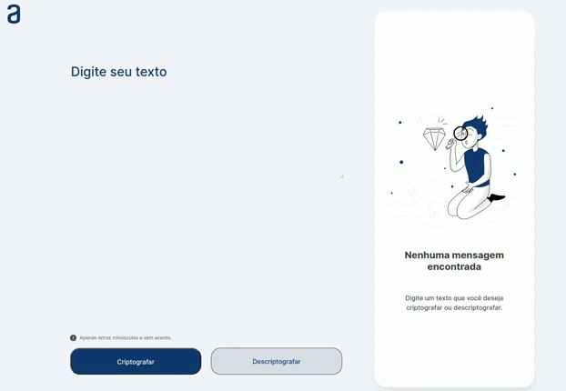

# Decodificador de Texto - Alura Challenges Oracle ONE.

## 💻 Projeto

 Este projeto foi desenvolvido para o Challenge ONE: Iniciante em programação que foi pensado para colocar em prática os conhecimentos adquirindo enquanto fez os cursos da trilha de aprendizagem.

## 📽️ Demo

Use on-line em [Decodificador](https://celsoaquino.github.io/decodificador-texto/)

## 🧑‍💻 Tecnologias

#### Esse projeto foi desenvolvido com as seguintes tecnologias:

- HTML
- CSS
- JavaScript

